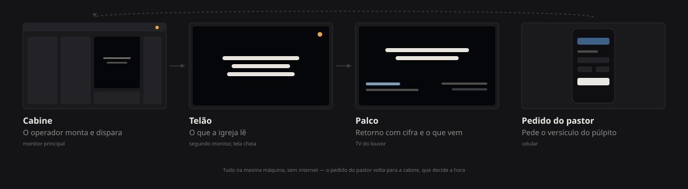

<p align="center">
  
</p>

<p align="center">
  <a href="#no-culto"><b>No culto</b></a> ·
  <a href="#instalar-no-pc-da-igreja">Instalar</a> ·
  <a href="#atalhos-da-cabine">Atalhos</a> ·
  <a href="#temas">Temas</a> ·
  <a href="#rodar-o-código">Código</a>
</p>

---

Lúmen projeta letra, versículo, aviso e mídia no telão da igreja. Foi feito para
um voluntário operar no escuro, sem errar na frente de todo mundo: o que está no
ar é sempre a coisa mais clara da tela, os controles nunca mudam de lugar e a
Bíblia inteira funciona **sem internet**.

<br>

<p align="center">
  
</p>

## No culto

1. Abra o **Lúmen** pelo Menu Iniciar.
2. **Windows + P → Estender** — não use *Duplicar*, senão a cabine vai junto para o telão.
3. **Tela → Abrir projetor.** Se houver segundo monitor, ele já vai sozinho, em tela cheia.
4. **F5** apresenta. **Esc** encerra.

O ponto no canto superior direito é o *tally*, emprestado da luz vermelha de
câmera de TV: cinza quando está parado, âmbar pulsando quando a igreja está
vendo, e só o aro âmbar quando o telão está preto ou na logo.

## Instalar no PC da igreja

```bash
npm run win:exe
```

| Arquivo | Para quê |
|---|---|
| `dist-win/release/Lúmen-Setup-<versão>-x64.exe` | Instala com atalho na área de trabalho e no Menu Iniciar. **Não pede senha de administrador.** |
| `dist-win/release/win-unpacked/Lúmen.exe` | Abre com dois cliques, sem instalar. Cabe num pendrive. |

O Windows avisa “editor desconhecido” na primeira vez — o app não é assinado.
**Mais informações → Executar assim mesmo.**

<details>
<summary>Se o empacotamento falhar com <code>EPERM</code></summary>

<br>

O Defender segura os binários recém-extraídos do Electron, e em pastas dentro de
`Downloads` isso acontece com frequência. Compile para fora dali:

```bash
npm run desktop:build
npx electron-builder --win --x64 --publish never --config.directories.output=%LOCALAPPDATA%\lumen-build
```

Ou adicione a pasta do projeto às exclusões do Defender (precisa de administrador).

</details>

## O que ele faz

| | |
|---|---|
| **Letras** | Busca no Letras e no Vagalume enquanto você digita, e quebra em slides sozinho |
| **Bíblia** | Almeida 1819 embutida, offline. Mosaico dos 66 livros coloridos por seção |
| **Mídia** | Uma pasta no disco por tipo — vídeo, áudio, imagem — com favoritos |
| **Temas** | 33 no total, doze com fundo animado |
| **Palco** | Retorno com cifra, comentário e o que vem depois |
| **Púlpito** | O pastor pede o versículo pelo celular; a cabine decide a hora |
| **Emergência** | `F9` põe um versículo de socorro no ar |
| **Recuperação** | Se o app fechar no meio do culto, ele oferece voltar ao ponto exato |

## Atalhos da cabine

No escuro, teclado é mais rápido que mouse.

| Tecla | Faz |
|---|---|
| `F5` | Apresenta o preview |
| `Esc` | Para |
| `→` `←` `Espaço` | Próximo e anterior slide |
| `B` | Apaga o telão |
| `L` | Logo da igreja |
| `C` | Some a letra, mantém o fundo |
| `Ctrl+K` | Busca universal e copiloto |
| `Ctrl+B` | Bíblia |
| `Ctrl+N` | Próximo item do culto |
| `Ctrl+1…9` | Item N do culto |
| `F8` | Modo operador |
| `F9` | Emergência |
| `?` | Todos os atalhos |

## Temas

Trinta e três, nomeados pelo momento do culto em que servem — quem opera procura
“Ceia” ou “Batismo”, não “gradiente vermelho”.

Os doze animados são **desenhados em CSS, não em vídeo**: o app roda offline num
PC modesto, e arquivo de vídeo somaria centenas de MB ao instalador e CPU ao
culto inteiro. Custam zero byte e se movem por `transform` e `opacity`, que a
placa de vídeo resolve sem repintar a tela.

> Aurora · Brasas · Poeira de luz · Respiro · Maré · Vitral · Chuva fina ·
> Névoa · Noite estrelada · Veludo · Trigo · Alva

O ajuste **baixo desempenho** desliga o papel de parede inteiro, e
`prefers-reduced-motion` congela o resto.

## Rodar o código

Requer [Node.js 22](https://nodejs.org/).

```bash
git clone https://github.com/orleanss777-sys/igreja-projetor.git
cd igreja-projetor
npm install
npm run dev
```

| Comando | Faz |
|---|---|
| `npm run dev` | Cabine no navegador |
| `npm test` | Testes |
| `npm run typecheck` | TypeScript |
| `npm run lint` | ESLint |
| `npm run desktop:build` | Compila a interface do app Windows |
| `npm run win:exe` | Gera o app e o instalador |

## Como está organizado

```
src/
  components/operator/   cabine, modo operador, Bíblia, diálogos
  components/slide/      o que aparece no telão, no palco e no preview
  components/ui/         botão, campo, menu, abas, diálogo
  lib/                   Bíblia, letras, mídia, temas, transição
  store/                 estado do culto e das operações
desktop/                 app Windows (Electron) e processo principal
  media.cjs              pastas de mídia, com caminho preso
  lyrics.cjs             Letras e Vagalume
public/                  Almeida 1819 e as imagens de tema
scripts/                 empacotamento, ícone e testes de desktop
```

## Licença e conteúdo

O código é do projeto. O texto bíblico embutido é a **Almeida 1819, em domínio
público**. Não acompanham NVI, NAA nem outras versões com direitos — importe só
o que a igreja tem permissão de usar.

O mesmo vale para letra de música: o Lúmen ajuda a **encontrar** o texto, e cabe
à igreja ter o direito de projetar (domínio público, CCLI ou autorização direta).
